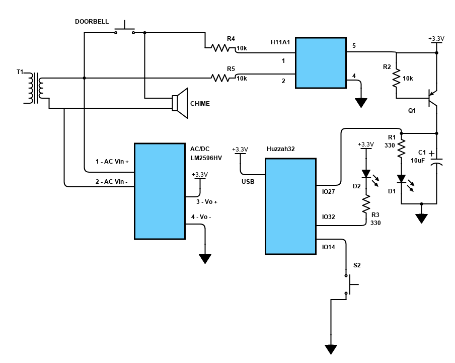
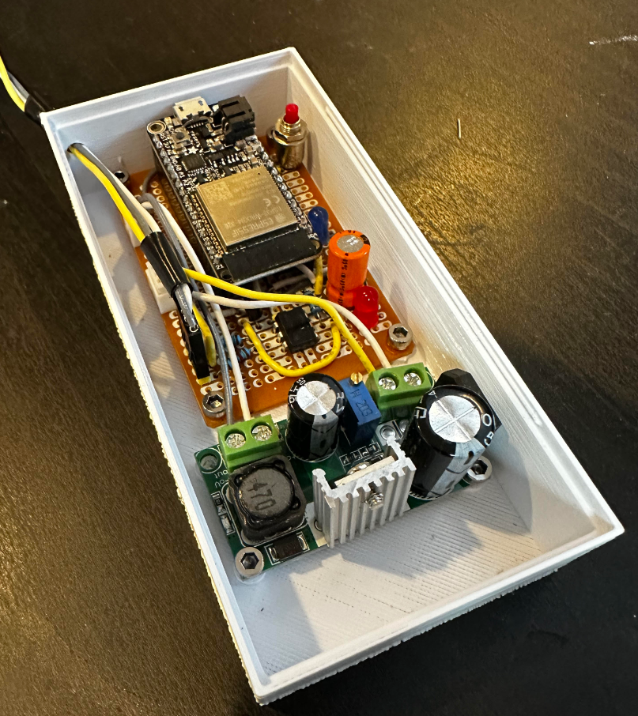

# Teams Doorbell Monitor


Tested with Adafruit Huzzah32 and MicroPython 1.20.0.

Circuit is based heavily on https://lowpowerlab.com/2015/04/13/doorbell-moteino/.





Parts
-----

* 1 - Adafruit Huzzah32
* 1 - Momentary SPST switch
* 2 - LED
* 3 - 10k Ohm resistor
* 2 - 330 Ohm resistor
* 1 - H11A1 Optoisolator
* 1 - 10uF capacitor
* 1 - LM2596HV AC/DC Converter

Setup
-----

1. Get ESPTOOL and Adafruit AMPY

```
$ python3 -m pip install esptool adafruit-ampy
```

2. Plug-in Huzzah32 USB to computer, determine the port being used

```
$ python3 -m esptool chip_id
```

3. Install MicroPython (replace PORT with port found in step 2)

```
$ python3 -m esptool --chip esp32 --port PORT erase_flash
$ python3 -m esptool --chip esp32 --port PORT --baud 460800 write_flash -z 0x1000 esp32-20230426-v1.20.0.bin
```

4. Copy `main_cfg.py.tmpl` to `main_cfg.py` and edit it with your settings

5. Press reset button, load software

```
$ python3 -m ampy.cli -p COM3 put main_cfg.py
$ python3 -m ampy.cli -p COM3 put main.py
$ python3 -m ampy.cli -p COM3 put boot.py
```

Once `boot.py` is loaded, the device will automatically run the `main.py`.  If logical-pin #32 is held low
at startup the boot will skip main and go into REPL mode.  This will allow you to connect to the serial
port to execute commands or run ampy.cli to update files.